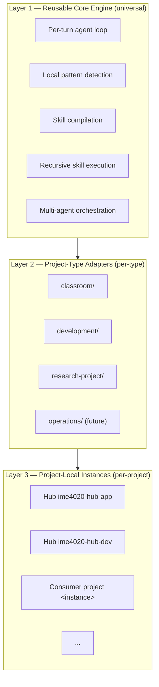
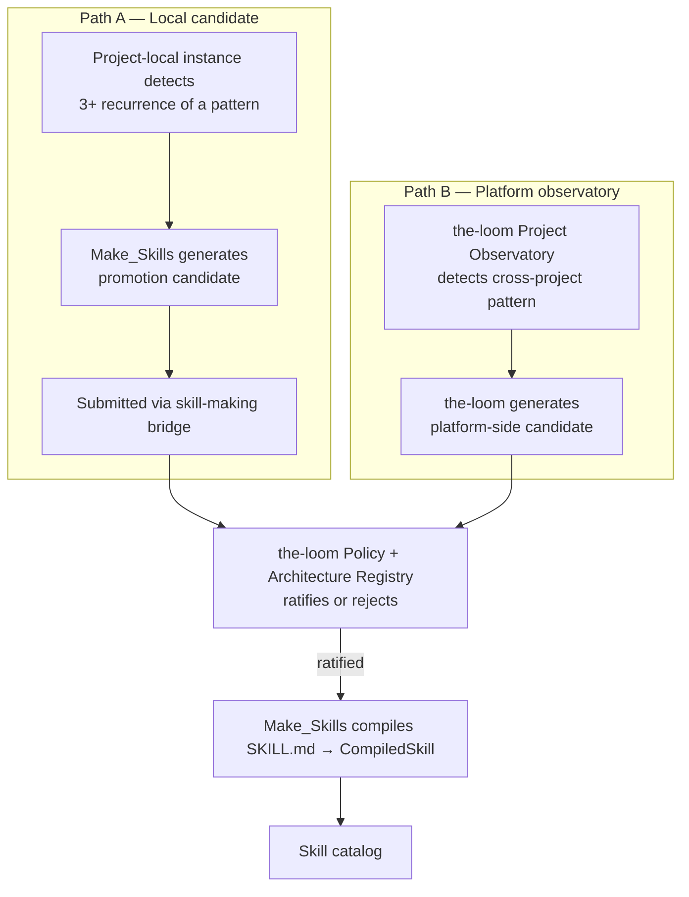

# Make_Skills

[](LICENSE)

The **recursive skill engine** — the piece that watches a user's agent work, notices repeated patterns, generates skill candidates, and compiles approved candidates into runnable capability. Three layers: reusable core + project-type adapters + project-local instances.

Sits inside a multi-module platform alongside `the-loom` (cross-project intelligence + memory + observatory + governance) and per-project consumers (your applications).

## The boundary rule

> **Make_Skills improves local agency and produces candidates. The-loom observes across projects, governs promotion, and stores durable structure.**

Make_Skills owns local agency-pattern detection inside a project instance. The-loom owns cross-project structure recognition, promotion governance, and canonical durable structure. Read [`docs/proposals/2026-05-31-three-layer-engine-spec.md`](docs/proposals/2026-05-31-three-layer-engine-spec.md) for the full module spec.

## The three layers



| Layer | Lives in | What it owns |
|---|---|---|
| **Reusable core** | `core/` (post-migration; currently `platform/api/`) | Pattern detection, skill formation, promotion-candidate generation, runtime agent loop, recursive workflow refinement, skill compilation |
| **Project-type adapters** | [`adapters/<type>/`](adapters/) | Customizes the core for one CLASS of consuming projects (classroom-support-app, software-development, research-project, etc.) |
| **Project-local instances** | Each consuming project's `.project-intelligence/<instance-id>/` (NOT in this repo) | Local skill candidates, observed workflows, user preferences, promotion candidates — the project's own evidence |

## How Make_Skills fits in the wider platform

```mermaid
flowchart LR
    subgraph LOOM["the-loom (platform — cross-project)"]
        direction TB
        L1[Memory MCP]
        L2[Project Registry]
        L3[Project Observatory]
        L4[Architecture Registry]
        L5[Policy / Promotion Governance]
    end

    subgraph MS["Make_Skills (this repo)"]
        direction TB
        M1[Core engine]
        M2[Adapters]
        M3[Skill catalog]
    end

    subgraph CONS["Consuming projects"]
        direction TB
        P1["Consumer A (classroom)"]
        P2["Consumer B (research)"]
        P3["..."]
        P4["..."]
    end

    CONS -- "agent endpoint requests" --> MS
    MS -- "memory_recall / memory_write" --> LOOM
    MS -- "telemetry (OTLP)" --> LOOM
    MS -- "promotion candidates" --> LOOM
    LOOM -- "ratified structure / catalog reads" --> MS
    MS -- "compiled skills" --> CONS
```



| Module | Role |
|---|---|
| **Make_Skills** | The skill engine. Detects local patterns, compiles skills, runs the agent loop. (You are here.) |
| **the-loom** | The platform. Memory MCP, project registry, observatory, governance, durable structure. |
| **Consuming applications** | Each consumer is its own repo. Different consumer shapes (classroom, development, research-project) attach a Layer-2 adapter that customizes the engine. |

## The two promotion paths

A "promotion" is when a local repeated pattern becomes durable cross-project structure (a published skill, an architectural node). Two paths converge at the same governance point in the-loom:



See [`docs/proposals/2026-05-25-skill-making-bridge.md`](docs/proposals/2026-05-25-skill-making-bridge.md) for the wire format between Make_Skills and the-loom.

## Repo layout (current + target)

**Today** — engine code is at `platform/api/`. Migration to the target shape is staged across 5 phases per [`docs/plans/2026-06-01-mvp-migration.md`](docs/plans/2026-06-01-mvp-migration.md).

**Target** (after migration):

```text
Make_Skills/
├── core/                          Layer 1 — reusable core engine
│   ├── runtime/                   Per-turn agent loop
│   ├── skill_making/              Skill compilation pipeline
│   ├── providers/                 Multi-model provider registry
│   ├── orchestration/             Subagent composition
│   ├── auth/                      JWT verification + tenant resolution
│   ├── db/                        Postgres setup
│   ├── tools/                     Generic agent tools
│   └── observability/             Telemetry emission helpers ONLY
│                                  (the Project Observatory itself lives in the-loom)
│
├── adapters/                      Layer 2 — project-type adapters (stubbed today)
│   ├── classroom/
│   ├── development/
│   └── research-project/
│
├── services/                      API + admin surfaces
│   ├── api/                       Entry point (uvicorn target)
│   ├── skill_making/              Receives promotion candidates from the-loom
│   └── admin/                     Inspectors, dev tooling
│
├── skills/ + skills_private/      Methodology skill library (bundled, per-project copies allowed)
├── subagents/                     Subagent definitions
├── deprecated/                    Old code retained for reference until proof unused
└── docs/                          Proposals, plans, decisions, runbooks, architecture
```

## Quick start (self-host, current state)

```bash
git clone https://github.com/Lizo-RoadTown/Make_Skills.git
cd Make_Skills/platform/deploy
cp .env.template .env
# Edit .env — at minimum set ANTHROPIC_API_KEY
docker compose up -d --build
```

Engine listens on `:8001` (local) / `${PORT:-10000}` (Render). Point a consumer at it.

After the MVP migration (in flight), the entrypoint moves from `api.main:app` to `services.api.main:app`. The Quick start command stays the same — Docker layer abstracts it.

## Documentation map

**Front-facing:**

- [README.md](README.md) — you are here
- [ARCHITECTURE.md](ARCHITECTURE.md) — module structure, two-mode discipline, contribution rules
- [CONTRIBUTING.md](CONTRIBUTING.md) — how to contribute, dual-mode discipline
- [ROADMAP.md](ROADMAP.md) — what's shipped, in flight, planned
- [CHANGELOG.md](CHANGELOG.md) — per-version changes

**Architecture (deep)**:

- [`docs/proposals/2026-05-31-three-layer-engine-spec.md`](docs/proposals/2026-05-31-three-layer-engine-spec.md) — the canonical module spec
- [`docs/proposals/2026-05-25-skill-making-bridge.md`](docs/proposals/2026-05-25-skill-making-bridge.md) — wire contract with the-loom
- [`docs/proposals/make-skills-engine-vs-consumer-scope.md`](docs/proposals/make-skills-engine-vs-consumer-scope.md) — engine/consumer boundary
- [`docs/proposals/application-vs-dev-tooling-scope.md`](docs/proposals/application-vs-dev-tooling-scope.md) — application/dev-tooling boundary

**Plans (time-bounded execution)**:

- [`docs/plans/2026-06-01-mvp-migration.md`](docs/plans/2026-06-01-mvp-migration.md) — staged migration to the three-layer shape

**Adapter contracts** (Layer 2):

- [`adapters/README.md`](adapters/README.md) — what an adapter is + the contract
- [`adapters/classroom/`](adapters/classroom/), [`adapters/development/`](adapters/development/), [`adapters/research-project/`](adapters/research-project/)

**Runbooks**:

- [`docs/runbooks/`](docs/runbooks/) — operational guides

## Two-mode commitment

Every change considers BOTH self-host AND hosted-multitenant. `PLATFORM_MODE=self_host` (default) or `=hosted`. Tests cover both. Documented in [ARCHITECTURE.md](ARCHITECTURE.md) and enforced via [CONTRIBUTING.md](CONTRIBUTING.md).

## Status

- **Layer 1 (`core/`):** populated. The MVP migration moved every runtime module out of `platform/api/` into `core/` + `services/`.
- **Layer 2 (`adapters/`):** stubs only — three `README.md` files defining the adapter contract for `classroom`, `development`, `research-project`. Populating per-adapter is post-MVP work.
- **Layer 3 (project-local instances):** live in each consuming repo's `.project-intelligence/<instance-id>/`, not in this repo.
- **Skill-making bridge to the-loom:** wire spec ratified; receiver stub in [`services/skill_making/bridge_receiver.py`](services/skill_making/bridge_receiver.py); full implementation pending.
- **Memory layer:** delegated to the-loom MCP (see [CLAUDE.md](CLAUDE.md) CORE DIRECTIVE 1).

## License

Apache 2.0 — see [LICENSE](LICENSE).
