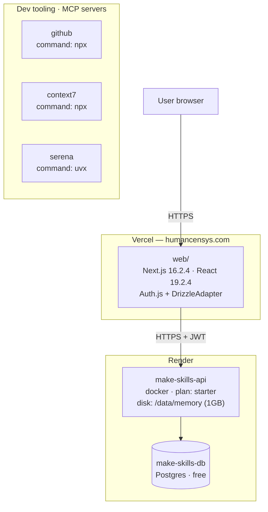

# Architecture snapshot — 2026-05-22T23:53:19.211624+00:00

**Git SHA:** `2decfb7b6fff136a6918799d59ef058b5d609ded`  
**Generated by:** `scripts/architecture_snapshot.py`  

This snapshot is deterministic and machine-generated. For prose narrative
and diagnosis, see the matching `-narrative.md` (produced by the
architecture-analyst agent).

## Diagram

## Render (backend hosting)

### Service: `make-skills-api`
- Runtime: docker, plan: starter, region: oregon
- Persistent disk: `/data/memory` (1 GB, name `memory-data`)
- Auto-deploy: True, previews: automatic, health check: `/healthz`
- Env var keys (19): `AGENT_CONFIG_PATH`, `AGENT_REPO_ROOT`, `ANTHROPIC_API_KEY`, `AUTH_SECRET`, `DATABASE_URL`, `GOOGLE_API_KEY`, `GROQ_API_KEY`, `HUGGINGFACEHUB_API_TOKEN`, `LANGSMITH_API_KEY`, `LANGSMITH_PROJECT`, `LANGSMITH_TRACING`, `LLAMA_CLOUD_API_KEY`, `MEMORY_DATA_DIR`, `OLLAMA_AUTH_HEADER`, `OLLAMA_BASE_URL`, `OPENAI_API_KEY`, `PLATFORM_MODE`, `TAVILY_API_KEY`, `TOGETHER_API_KEY`

### Database: `make-skills-db`
- Plan: free, database name: `make_skills`, region: oregon

## Web (Next.js frontend)

- Package: `web` v0.1.0
- Scripts: `dev`, `build`, `start`
- Total dependencies: 19
- Key pinned versions:
  - `@auth/drizzle-adapter`: `^1.11.2`
  - `@xstate/react`: `^6.1.0`
  - `drizzle-orm`: `^0.45.2`
  - `fumadocs-core`: `^16.8.5`
  - `fumadocs-ui`: `^16.8.5`
  - `motion`: `^12.38.0`
  - `next`: `16.2.4`
  - `next-auth`: `^5.0.0-beta.31`
  - `pg`: `^8.20.0`
  - `react`: `19.2.4`
  - `react-dom`: `19.2.4`
  - `xstate`: `^5.31.0`

## Platform API (FastAPI backend)

- Total packages in `requirements.txt`: 21
- Highlights: `deepagents`, `langchain`, `langgraph`, `fastapi`, `lancedb`, `fastembed`, `pyarrow`, `mcp`, `watchdog`, `pyyaml`, `pytest`

## Auth wiring (`web/auth.ts`)

- **Adapter:** Drizzle (`@auth/drizzle-adapter`)
- **DB imports:** `./db`

## MCP servers (`.mcp.json`)

- `github` — command: `npx` (args: 2)
- `context7` — command: `npx` (args: 2)
- `serena` — command: `uvx` (args: 4)
